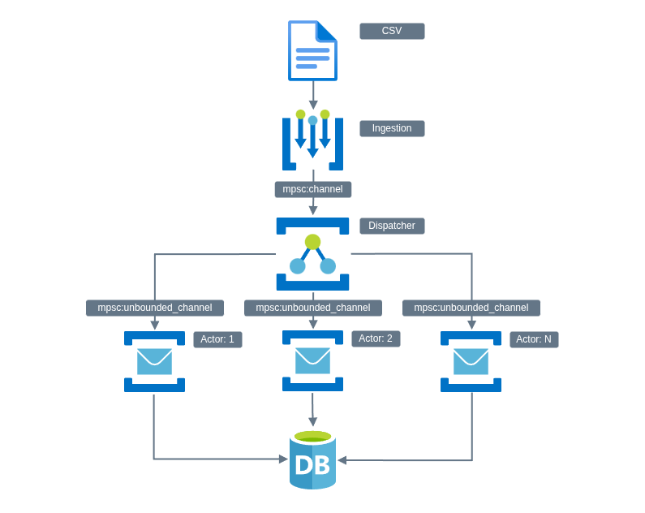

# Async Transaction Engine

A high-performance, asynchronous transaction processing engine built in Rust. It reads a series of financial transactions from a CSV file, processes them concurrently while maintaining strict ordering per client, and outputs the final account states.

## Features

- **Asynchronous Pipeline:** Built on `tokio` for efficient, non-blocking I/O and task scheduling.
- **Streaming Processing:** Reads input incrementally using bounded channels, allowing the system to handle datasets larger than available memory with backpressure.
- **Actor Model:** Each client account is managed by a dedicated actor, ensuring operations for a single account are serialized and race-free without complex locking mechanisms.
- **Actor Passivation:** Leverages the `moka` cache to automatically manage actor lifecycles. Idle actors are "passivated" (persisted and dropped from memory) to ensure the system can scale to millions of unique accounts without exhausting RAM.
- **Precision Math:** Uses a custom fixed-point `Monetary` type (4 decimal places) to avoid floating-point errors.
- **High Performance:** Processes **500,000 transactions in ~300ms** (peaking at over **1.7 million transactions per second**) on an **Intel Core i9-14900K with 64GB DDR5 (6800 MT/s)**.
- **Clean Architecture:** Designed with strict modularity to ensure the codebase remains readable, maintainable, and easily testable.
- **Observability:** Integrated with the `tracing` ecosystem for structured logging, allowing for fine-grained monitoring of transaction flows and error states.

## Architecture

The system uses an actor architecture to ensure data integrity without global lock contention:



1.  **Ingestion:** A dedicated task streams CSV records into a bounded `mpsc` channel, providing backpressure for large datasets.
2.  **Dispatch:** Transactions are routed to client-specific `AccountActors` via an LRU cache (`moka`). This ensures all operations for a single client are serialized, preventing race conditions on balances.
3.  **Passivation & Re-hydration:** To efficiently manage millions of accounts, actors are only active in memory while processing transactions. If an actor becomes idle or the cache reaches capacity, it is automatically "passivated" (dropped from memory) after its state is persisted. When a new transaction for that account arrives, the actor is "re-hydrated" from storage.
4.  **Processing:** Actors apply business logic (deposits, disputes, etc.) and maintain local transaction history for dispute resolution.
5.  **Persistence:** Final states are persisted into an optimized `DashMap` storage layer, allowing for efficient concurrent access during the final output phase.
6.  **Output:** Results are streamed to STDOUT using a buffered writer to minimize overhead.

## Concurrency & Safety

- **Actor Isolation:** Shared state is eliminated by delegating account ownership to individual actors. This removes the need for mutexes/locks during the core processing phase.
- **Arithmetic Safety:** The `Monetary` type utilizes `checked_add` and `checked_sub` throughout the state machine to prevent balance corruption on overflows.
- **Memory Safety:** The implementation uses **100% safe Rust**. No `unsafe` blocks are used in the engine, storage, or arithmetic utilities.
- **Backpressure:** Bounded channels prevent memory exhaustion when processing files significantly larger than available memory.

## Design Decisions

### Why Actors?
Financial transactions for a single account must be processed in order (e.g., you can't withdraw funds before you deposit them). However, transactions for *different* accounts are independent. The Actor Model fits this perfectly: strict serialization for a single client, but massive parallelism across different clients.

### Why Moka / Actor Passivation?
A production transaction engine might process transactions for millions of unique accounts. Keeping all those actors and their channels alive in memory would quickly exhaust system resources. By using `moka` to manage our actors, we can implement an LRU (Least Recently Used) cache policy. This allows the system to keep "hot" accounts (those with high transaction volume) in memory while "passivating" (storing to disk/DB and dropping) accounts that have gone idle. 

By default, the engine is configured with:
- **Max Capacity:** 5,000 active actors.
- **Idle Timeout:** 5 minutes.

This architecture allows the system to handle datasets far larger than available memory by only keeping active accounts in memory.

### Fixed-Point Arithmetic
Using `f64` for currency is dangerous due to precision loss. With the help of AI, I implemented a `Monetary` struct wrapping `i64` with 4 decimal places of precision. This guarantees exactness for all supported operations.

### Error Handling Strategy
*   **Unrecoverable Errors:** Malformed CSV rows are skipped with an error log.
*   **Recoverable Errors:** Business logic errors (insufficient funds, duplicate transactions) are logged but do not crash the actor. The system continues processing valid transactions.
*   **Safety:** The system errors on the side of caution, locking accounts on chargebacks and rejecting ambiguous negative inputs.

## Assumptions

*   **Currency Precision:** All monetary values are handled with fixed-point arithmetic (4 decimal places) to prevent floating-point errors.
*   **Duplicate Transactions:** Transactions with duplicate IDs are rejected to ensure idempotency.
*   **Negative Amounts:** The system explicitly rejects negative values for `deposit` and `withdrawal` transactions. A negative deposit is semantically a withdrawal but lacks the necessary "insufficient funds" checks. Allowing it would create a security vulnerability where users could bypass balance checks or corrupt dispute states.
*   **Locked Accounts:** Once an account is locked (due to a chargeback), it rejects all subsequent transactions.

## Structure

```
src
├── actors
│   ├── mod.rs
│   ├── account_actor.rs    # Message processing for a single client
│   └── tests.rs            # Async actor behavioral tests
├── engine
│   ├── mod.rs
│   ├── async_engine.rs     # Orchestration of the processing pipeline
│   └── tests.rs            # Engine-level orchestration tests
├── models
│   ├── mod.rs
│   ├── account.rs          # State machine logic
│   ├── errors.rs           # AccountError definitions and helpers
│   ├── tests.rs            # Business logic unit tests
│   └── transaction.rs      # Transaction data structures
├── storage
│   ├── mod.rs
│   ├── account_storage.rs  # DashMap-backed storage
│   └── tests.rs            # Storage persistence tests
├── types
│   ├── mod.rs
│   ├── errors.rs           # MonetaryError definitions
│   ├── monetary.rs         # Fixed-point arithmetic
│   └── tests.rs            # Arithmetic and parsing unit tests
└── main.rs                 # CLI entry, logging, and output
```

## Dependencies

The project leverages several high-quality Rust crates:

- **tokio:** Asynchronous runtime for task orchestration and I/O.
- **csv:** High-performance, streaming CSV serialization/deserialization.
- **serde:** The "de facto" framework for serializing and deserializing Rust data structures.
- **dashmap:** A blazing-fast concurrent hash map used for the account storage layer.
- **moka:** A high-performance, concurrent caching library used to manage our Actor lifecycles.
- **tracing / tracing-subscriber:** For structured logging and diagnostic observability.
- **anyhow / thiserror:** For robust and ergonomic error handling.
- **futures:** Utilities for managing asynchronous control flow.

### Security Audit
As of January 30, 2026, all dependencies have been verified to be vulnerability-free according to the Rust Advisory Database. If you have `cargo-audit` installed, you can verify this by running:
```bash
cargo audit
```

## Testing

The project includes both unit and integration tests:

```bash
# Run all tests (unit and integration)
cargo test

# Run a specific test (e.g., the correctness integration test)
cargo test test_cli_outputs_correct_final_balances
```

## Stress Testing

A high-volume stress test generator is provided as a Rust example. This script generates a CSV with realistic transaction flows (deposits, withdrawals, disputes, resolves, and chargebacks).

```bash
# Generate 1 million transactions for 10,000 clients
cargo run --example generate_stress_test --release

# Generate a custom amount (e.g., 5 million records for 50k clients)
cargo run --example generate_stress_test --release -- 5000000 50000
```

## Building

### Standard Build
```bash
cargo build
```

### Release Build
For peak performance, use the release profile:
```bash
cargo build --release
```

The `Cargo.toml` is tuned for maximum throughput using the following release optimizations:
- `opt-level = 3`: Enables all available optimizations for speed.
- `lto = true`: Performs Link-Time Optimization across all crates in the dependency graph.
- `codegen-units = 1`: Restricts the compiler to a single unit, maximizing optimization opportunities.
- `panic = "abort"`: Removes unwinding code to reduce binary size and improve performance.
- `strip = true`: Removes all symbol information to minimize the final binary footprint.

## Running

```bash
# Basic run (defaults to error logging only)
cargo run -- transactions.csv > accounts.csv

# Run with custom log level (info, debug, trace)
cargo run -- transactions.csv debug > accounts.csv

# Run using the provided sample file with info logging
cargo run -- samples/sample.csv info > accounts.csv
```

## Future Work for a Production Implementation

While this CLI tool operates on a local CSV, the architecture was designed to resemble a distributed stream processor (like Kafka consumers, see my NOTE areas in the code). Here is how it would scale:

*   **Partitioning:** In a distributed setup, transactions would be partitioned by `client` (e.g., in Kafka). This ensures all events for a single user land on the same consumer, preserving the strict ordering required for financial ledgers without global locks. A proper client ID hashing strategy would need to be discussed and decided.
*   **Backpressure:** The internal `mpsc` channel used here mimics a bounded buffer. In production, this would be the consumer offset.
*   **Idempotency:** The duplicate transaction checks currently implemented are crucial for delivery semantics common in message queues.
*   **Persistence:** The `AccountStorage` currently uses an in-memory `DashMap`. In production, this would be backed by a high-throughput database (e.g., Redis for hot state, Postgres for ledger history), with the Actor saving state after every batch or transaction.


## AI Usage

- AI was used to generate the sample data, method documentation (comments), some documentation cleanup, and some of the unit tests, cleanup and optimization was performed by hand.
- AI was used to discuss a fixed point arithmetic `Monetary` type.  It helped generate the basis of this type and several traits but, not all code for this type, cleanup and optimization was performed by hand.
- The remainder of the code and the architectural/design decisions are my own work.

## Author

Justin Fillmore
